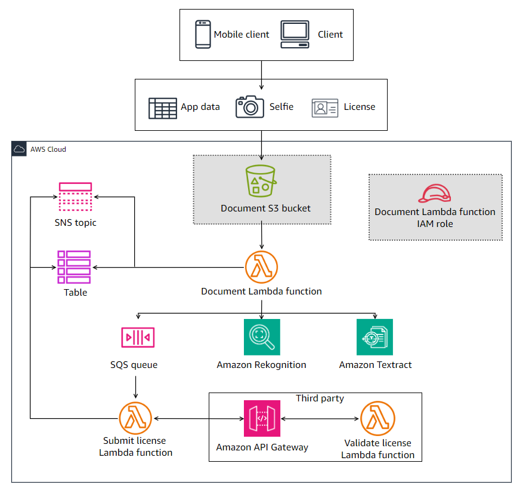

# 🏦 ACI Capstone: Customer Onboarding App for AnyCompany Bank

Welcome! This is my capstone project for the AWS Cloud Foundations Program at Amazon Cloud Institute (ACI). It simulates a customer onboarding backend system for AnyCompany Bank using cloud-native AWS services.

---

## 🔍 Project Overview

The onboarding system validates a customer's:
- Application information (CSV)
- Selfie photo
- Driver's license

These documents are verified using AWS Rekognition, Textract, and a third-party license validation API.

---

## 🧠 Objectives

- Automate identity verification
- Leverage serverless AWS infrastructure
- Integrate third-party APIs
- Create a scalable, secure, and real-world cloud application

---

## 🛠️ Tech Stack

| Tool/Service         | Purpose                            |
|----------------------|-------------------------------------|
| Amazon S3            | Store uploaded documents            |
| AWS Lambda           | Serverless document validation      |
| Amazon Rekognition   | Face comparison between selfie and ID |
| Amazon Textract      | Extract data from license           |
| Amazon DynamoDB      | Store onboarding status             |
| SNS & SQS            | Decouple services and ensure reliability |
| Amazon API Gateway   | Connect with third-party service    |
| IAM Roles            | Secure access control               |

---

## 📐 Architecture Diagram

---

## 📅 Weekly Progress

| Week | Focus                                       |
|------|---------------------------------------------|
| 1    | Created S3 bucket, configured bucket policy, and created IAM role   |

---

## 🚀 How to Deploy (Coming Soon)

---

## 📚 Lessons Learned

Each lab will include a "What I learned" section in the `/docs` folder.

---

## 👨‍💻 Author

Carlos Manuel Cordova Ortiz  
Cloud Application Developer | ACI Student  
[LinkedIn](https://www.linkedin.com/in/carloscordovadev)

---

## 📜 License

MIT
